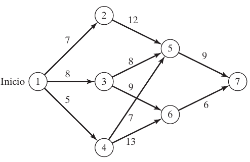

## Introducción

La idea principal de la programación dinámica (PD) es descomponer el problema en subproblemas (más manejables). Los cálculos se realizan entonces recursivamente donde la solución óptima de un subproblema se utiliza como dato de entrada al siguiente problema. La solución para todo el problema está disponible cuando se soluciona el último subproblema. La forma en que se realizan los cálculos recursivos depende de cómo se descomponga el problema original. En particular, normalmente los subproblemas están vinculados por restricciones comunes. La factibilidad de estas restricciones comunes se mantiene en todas las iteraciones.

### Problema de la ruta más corta

Supongamos que deseamos seleccionar la ruta por carretera más corta entre dos ciudades. La red en la figura siguiente proporciona las posibles rutas entre la ciudad de inicio en el nodo 1 y la ciudad destino en el nodo 7. Las rutas pasan por ciudades intermedias designadas por los nodos 2 a 6.

Podemos resolver este problema enumerando todas las rutas entre los nodos 1 y 7 (hay cinco rutas). Sin embargo, la enumeración exhaustiva es computacionalmente insoluble en redes grandes.

Para resolver el problema por PD, primero lo descomponemos en etapas como se indica mediante las líneas de rayas verticales en la figura 12.2. A continuación, realizamos por separado los cálculos en cada etapa.

La idea general para determinar la ruta más corta es calcular las distancias (acumulativas) más cortas a todos los nodos terminales de una etapa, y luego utilizarlas como datos de entrada a la etapa inmediatamente subsiguiente. Partiendo del nodo 1, la etapa 1 llega a tres nodos terminales (2, 3 y 4) y sus cálculos son simples.

### Propiedades básicas de los cálculos de PD.

1. Los cálculos en cada etapa son una función de las rutas factibles de dicha etapa, y sólo de esa etapa.
2. Una etapa actual está conectada a la etapa inmediatamente precedente sólo (sin tener
en cuenta las etapas anteriores) con base en el resumen de distancias más cortas de la
etapa inmediatamente precedente.

#### Ecuación recursiva

Sea $f_i(x_i)$ la distancia más corta al nodo $x_i$ en la etapa $i$, y defina $d(x_{i-1},x_1)$ como la distancia del nodo $x_{i-1}$ al nodo $x_i$. La ecuación recursiva de PD se define como:

$$
f_0(x_0=1)=0\\
f_i(x_i)=min_{todas\ factibles\ (x_{i-1},x_i)\ rutas} \{d(x_{i-1},x_i)+f_{i-1}(x_{i-1})\},i=1,2,3
$$

Todas las distancias se miden desde 0 al establecer $f_0(x_0=1)$. La ecuación recursiva principal expresa la distancia más corta $f_i(x_i)$ en la etapa $i$ como una función del siguiente nodo, $x_i$. En terminología de PD, $x_i$ se conoce como el __estado__ en la etapa $i$. El estado conecta las etapas sucesivas de una manera que permite tomar decisiones factibles óptimas en una etapa futura independientemente de las decisiones que se hayan tomado en todas las etapas precedentes.

La definición del estado conduce al siguiente marco unificador para la PD.

#### Principio de optimalidad

Las decisiones futuras para todas las etapas futuras constituyen una política óptima independientemente de la política adoptada en todas las etapas _precedentes_.

La implementación del principio de optimalidad es evidente en los cálculos del ejemplo anterior. En la etapa 3, los cálculos recursivos en el nodo 7 utilizan la distancia más corta a los nodos 5 y 6 (es decir, los estados de la etapa 2) sin preocuparse sobre cómo se llega a los nodos 5 y 6 desde el nodo de inicio 1.

El principio de optimalidad no aborda los detalles de cómo se optimiza un subproblema. La razón es la naturaleza genérica del subproblema. Puede ser lineal o no lineal, y la cantidad de alternativas puede ser finita o infinita. Todo lo que hace el principio de optimalidad es “descomponer” el problema original en subproblemas más manejables computacionalmente.

##### Ejercicio 1

Resuelva el problema anterior, suponiendo que se utilizan las siguientes rutas:
$$
d(1, 2) = 5, d(1, 3) = 9, d(1, 4) = 8\\
d(2, 5) = 10, d(2, 6) = 17\\
d(3, 5) = 4, d(3, 6) = 10\\
d(4, 5) = 9, d(4, 6) = 9\\
d(5, 7) = 8\\
d(6, 7) = 9
$$

##### Ejercicio 2

Soy un ávido excursionista. El verano pasado, mi amigo G. Don y yo nos fuimos de campamento durante 5 días a las hermosas _White Mountains_ en _New Hampshire_. Decidimos limitar nuestra excursión a tres picos muy conocidos: Los montes _Washington_, _Jefferson_ y _Adams_. El monte Washington tiene un sendero de 6 millas de la base a la cumbre. Los senderos correspondientes de los montes Jefferson y Adams son de 4 y 5 millas. Los senderos que conectan las bases de las tres montañas son de 3 millas entre los montes Washington y Jefferson; de 2 millas entre los montes Jefferson y Adams, y de 5 millas entre los montes Adams y Washington. Comenzamos el primer día en la base del monte Washington y regresamos al mismo lugar al final de los 5 días. Nuestro objetivo era recorrer a pie tantas millas como pudiéramos. También decidimos escalar una montaña exactamente cada día y acampar en la base de la montaña que escalaríamos el siguiente día. Además, decidimos que no se podía visitar la misma montaña en dos días consecutivos. Utilice la PD para programar la caminata de 5 días.
